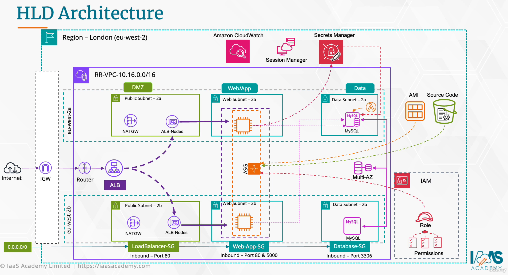

# Ritual Roast: Automated 3-Tier AWS Architecture

# 1. 🏞️ Background

Ritual Roast is a fictitious company embarking on an advertising campaign to engage with their customers by hosting a recipe competition where customers complete the online form with their recipe and contact details. The chefs will try the recipe and decide the winner to receive a prize. The company aims to build a mailing list from the emails for future campaigns.

# 2. 💡 Project Evolution & Motivation

This is the first of a three-part series of projects based on Ritual Roast. The projects are based on the architectural concepts from the [AWS Solutions Architect SAA-C03 – Hands-On Projects](https://www.udemy.com/course/aws-solutions-architect-capstone-projects/) course on Udemy. The original course consists of manual infrastructure deployments via the AWS Management Console. These projects convert that into a sophisticated Infrastructure as Code (IaC) deployment using **Terraform**. In implementing this project, I demonstrate my skills and ability to turn complex architectures into practical, production-worthy solutions.

This document is intended to be both technical and educational to bridge the gap for those new to IaC.

# 3. 🗺️ High-Level Design (HLD)

The diagram below is the schematics for Ritual Roast, provided in the course. This, along with the [Ritual Roast Resource Configuration](https://github.com/ManunEbo/Terraform-AWS-Ritual-Roast-Part-1/blob/main/documents/Ritual%20Roast%20Resource%20Configuration.pdf) document, provides the road map for this Terraform implementation. I've also included the python script [ritual-roast.py](https://github.com/ManunEbo/Terraform-AWS-Ritual-Roast-Part-1/blob/main/documents/ritual-roast.py) for completeness.



The HLD illustrates the 3-Tier Architecture with the **DMZ** presentation Tier, **Web/App** Application Tier, and **Data** the Data Tier. The presentation Tier consists of a LoadBalancer that accepts traffic from the internet and load-balances it to the Application Tier's Auto Scaling Group (ASG), consisting of highly available and resilient EC2 instances in the Web/App private subnets. The instances pull source codes from an S3 bucket to build the application. The application processes packets and communicates to and fro with the Data tier.

Communication between resources is enabled via security groups (i.e., only resources with the right security group attached can communicate, and vice versa). Security is further enhanced by preventing exposure to the internet for resources in private subnets. The Data tier is home to the RDS MySQL database with Multi-AZ failover. The database credentials are stored and rotated by Secrets Manager with the help of a lambda function which has a role to facilitate communication. There is a separate role to enable communication between the EC2 instances, the application, and the database.

# 4. 🌐 Networking

This project is deployed in the **"eu-west-2"** region. With the exception of the S3 bucket `rr-capstone-${bucket-hex}`, all the resources used in this project are deployed within the Ritual Roast VPC, **"ritual-roast-vpc"**. Note, S3 buckets are global and unique. The configuration specification for this project can be found at [Ritual Roast Resource Configuration](https://github.com/ManunEbo/Terraform-AWS-Ritual-Roast-Part-1/blob/main/documents/Ritual%20Roast%20Resource%20Configuration.pdf). A summary of this is presented under section "6. Technical highlights". It sets out what values to use for each resource, where possible, such as the VPC CIDR range **10.16.0.0/16**, hence all the subnet CIDR blocks, subnet names, and availability zones for each Tier, in addition to other resource parameter settings.

# 5. 🔒 Security

**Summary**: The security groups apply the principle of least privilege. They tightly restrict traffic (e.g., the DB only talks to the Web tier and Lambda secrets rotation function). EC2 instances sit in private subnets, only accessible via the ALB or Systems Manager (via the attached SSM IAM policy).

Since all subnets are by default associated with the VPC default route table, to prevent exposing private resources to the internet, a single route is created via NAT gateways placed in a public subnet that has an internet gateway (IGW) attached. This essentially gives private resources egress-only communication with the outside.

```hcl
route {
  cidr_block     = "0.0.0.0/0"
  nat_gateway_id = aws_nat_gateway.rr_nat_gateway.id
}

```

A separate route table is created for public resources to access the internet via the IGW.

```hcl
route {
  cidr_block = "0.0.0.0/0"
  gateway_id = aws_internet_gateway.ritual-roast-igw.id
}

```

## Security Groups

Security groups restrict ingress and egress communication between resources using rules.

### LoadBalancer-SG

1. Ingress rule that accepts traffic from the internet on port 80.
2. Egress rule allowing traffic to the application tier (i.e., any resource attached to the Web-App-SG security group).
3. This allows the ALB to send traffic to the Flask application served from the EC2 instances created by the ASG.

### Web-App-SG

1. Ingress rule that accepts traffic from LoadBalancer-SG on port 5000.
2. Egress rule that allows communication on any protocol to any IP.
3. Note: these instances are on a private subnet using a NAT gateway for outbound communication to the internet, thus security is not compromised.
4. Since security groups are stateful, it will redirect packets back to LoadBalancer-SG without explicitly defining an egress rule for that.
5. The single egress rule enables communication with Database-SG.

### Database-SG

1. Ingress rule accepting traffic on port 3306 from Web-App-SG.
2. Ingress rule accepting traffic on port 3306 from Lambda-SG.
3. Managed RDS instances do not initiate outbound connections, so there is no need for egress rules.

### Lambda-SG

1. Ingress rule accepting traffic from Database-SG on port 3306.
2. Egress rule allowing TCP traffic to any destination on port 443. This allows the lambda function to communicate with Secrets Manager.
3. Since the lambda function is placed in private subnets and accesses the internet via the NAT gateway, it cannot be reached from the outside.

## Secrets Manager

Secrets Manager is preferred over other methods of credential management for the following reasons:

* Minimizes human error from credential management entirely.
* Mitigates the dangers of storing credentials in static, plaintext that easily leak into source code or logs.
* Heavily minimizes the attack surface by fetching the secret dynamically at runtime.
* Lambda functions automatically rotate the password every 7 days, drastically narrowing the window of opportunity for an attacker to use a leaked key/password.
* Provides an audit trail via its native integration with AWS CloudTrail.

### Session Manager

Session Manager is preferred over SSH for the following reasons:

* **Zero Inbound Network Exposure**: SSH requires that the security group exposes port 22 on a publicly accessible subnet. Session Manager removes the need for bastion hosts; instances remain private. Instances are no longer constant targets for brute-force attacks and network scanners. Session Manager requires no open inbound ports, just an HTTPS outbound tunnel from the instance to the Systems Manager control plane.
* **Elimination of SSH Key Management**: No more sharing keys with other developers, forgetting to rotate keys, or facing the security risk of compromised keys. With Session Manager, AWS IAM handles the authentication and authorization.
* **Absolute Traceability & Tamper-Proof Logging**: SSH does not natively log what a user actually types once they get into the server. If a malicious actor or a mistake takes down a database, tracing back who ran the specific command on a shared Linux user account is incredibly difficult. Session Manager provides a built-in, tamper-proof audit trail where AWS records every single session. It can be configured to stream and save every single keystroke and command output directly to an encrypted Amazon S3 bucket or AWS CloudWatch logs, satisfying massive compliance frameworks (like SOC2 and PCI-DSS) out of the box.
* **Native Multi-Factor Authentication (MFA)**: Setting up MFA for standard Linux SSH usually requires complex, manual configurations with third-party PAM or complex bastion setups. Since authentication is enabled via IAM, we can make use of existing IAM or corporate identity provider policies, enforcing additional security measures via MFA for authentication.

# 6. 🚀 Technical Highlights

## VPC and Subnetting

Ritual Roast requires 16 subnets or sub-networks from the VPC CIDR **(10.16.0.0/16)**. This can be achieved by borrowing from the host bits. The table below shows the derivation of the subnets.

| n bits | n networks | New CIDR | New n host IP |
| --- | --- | --- | --- |
| 1 | 2^1 = 2 | /17 | 2^(32-17) = 2^15 = 32768 |
| 2 | 2^2 = 4 | /18 | 2^(32-18) = 2^14 = 16384 |
| 3 | 2^3 = 8 | /19 | 2^(32-19) = 2^13 = 8192 |
| 4 | 2^4 = 16 | /20 | 2^(32-20) = 2^12 = 4096 |
| 5 | 2^5 = 32 | /21 | 2^(32-21) = 2^11 = 2048 |
| 6 | 2^6 = 64 | /22 | 2^(32-22) = 2^10 = 1024 |
| 7 | 2^7 = 128 | /23 | 2^(32-23) = 2^09 = 512 |

Of the 16 subnets required by Ritual Roast, 4 are reserved for possible future AZs in **eu-west-2**. The remaining 12 subnets are broken down into 4 groups:

| Public subnets | Web subnets | App subnets | Data subnets |
| --- | --- | --- | --- |
| 10.16.0.0/20 | 10.16.64.0/20 | 10.16.128.0/20 | 10.16.192.0/20 |
| 10.16.16.0/20 | 10.16.80.0/20 | 10.16.144.0/20 | 10.16.208.0/20 |
| 10.16.32.0/20 | 10.16.96.0/20 | 10.16.160.0/20 | 10.16.224.0/20 |

To see the actual names allocated to each of the subnets, please refer to [Ritual Roast Resource Configuration](https://github.com/ManunEbo/Terraform-AWS-Ritual-Roast-Part-1/blob/main/documents/Ritual%20Roast%20Resource%20Configuration.pdf). Note, in every subnet, there are 5 IP addresses that are reserved and thus cannot be used:

* **10.16.0.0:** Network address
* **10.16.0.1:** Reserved by AWS for the VPC Router
* **10.16.0.2:** Reserved by AWS for the DNS server
* **10.16.0.3:** Reserved by AWS for future use
* **10.16.15.255:** Network broadcast address

Elastic IPs will be allocated for the NAT gateway and released when the project is destroyed. With respect to Terraform, the creation of the VPC and subnets are handled in [networking.tf](https://github.com/ManunEbo/Terraform-AWS-Ritual-Roast-Part-1/blob/main/networking.tf). Both the NAT gateway and the IGW creation are handled in [gateways.tf](https://github.com/ManunEbo/Terraform-AWS-Ritual-Roast-Part-1/blob/main/gateways.tf).

## AutoScaling Group (ASG)

The ASG bridges the gap between static infrastructure and dynamic, self-healing architecture. The use of 3 separate subnets in 3 different AZs ensures high availability within the region (i.e., if one AZ goes down, we still have 2 available).

### Launch template - Userdata

The original userdata script from the course had a few issues that needed attention. The command to run `ritual-roast.py` looked like:

```bash
nohup python3 ritual-roast.py > /var/log/flask-app.log 2>&1 &

```

This just ensures that the command runs in the background even if the shell is terminated, redirecting errors to standard out, but if the app crashes, this would not restart it.

Registering the application as a systemd service enables Linux to restart the service if it crashes. Additionally, using the `exec` command captures the entire script's output like a blackbox flight recorder:

```bash
exec > /var/log/user-data.log 2>&1

```

This is useful because AWS user data runs completely in the background, and if the script fails, it fails silently with no output. Putting the exec command at the top means we're collecting all the output, including errors, and redirecting them to a file.

Downloading the AWS `global-bundle.pem` ensures that communication with the database is secured via SSL. Adding the `-sS --fail -O` options ensures strict certificate checking is performed and that the script hard-fails if the secure connection cannot be verified. Ensuring root owns the certificate and providing read-only access for others enhances security. A SHA256 checksum would be an additional security enhancement to ensure the certificate has not been tampered with. Finally, the use of an isolated Python virtual environment prevents dependency conflicts between the application and the operating system's native tools.

### Updating Launch template

Updating the Launch template leads to AWS throwing an error regarding the ASG. AWS uses the name of the ASG as its unique identifier and does not allow two ASGs to exist with the same name simultaneously, nor does it allow renaming an ASG once created.

**The problem**: Terraform's default behavior attempts to create the new ASG with the new template before destroying the old ASG to prevent application downtime. AWS throws an error: *"AutoScalingGroup with name 'rr-asg' already exists."* Forcing Terraform to delete the old one first using lifecycle policies creates a different problem where Terraform times out waiting for AWS to drain traffic and delete the old ASG.

**The solution**: We bypass this by injecting random hex characters into the ASG name using the latest launch template version:

```hcl
${aws_launch_template.rr_launch_template.latest_version}-${random_id.asg_suffix.hex}

name = "rr-asg-${aws_launch_template.rr_launch_template.latest_version}-${random_id.asg_suffix.hex}"

```

This is a strategy called "Immutable Infrastructure"—replacing resources entirely instead of modifying them in place. This essentially acts as a Blue/Green style deployment where the end user experiences zero downtime.

### Target tracking configuration

Target tracking allows the infrastructure to smooth out spikes in traffic without over-provisioning and wasting money. This process is facilitated by communication between the ALB, CloudWatch, and the ASG. Setting the target tracking to 50.0 is the middle ground.

```hcl
target_tracking_configuration {
  predefined_metric_specification {
    predefined_metric_type = "ASGAverageCPUUtilization"
  }
  target_value = 50.0

  disable_scale_in = false
}

```

When traffic increases, the ALB distributes traffic, CPU spikes above the 50% threshold, a CloudWatch alarm is triggered, and the ASG spins up an extra instance based on the Launch template. The instance prepares to receive traffic in the warm-up period (3 minutes), runs the `user_data` script, and once ready, the ALB registers it to reduce the average CPU utilization back towards 50%.

When traffic drops, the CPU utilization triggers a "Low CPU Alarm." The `disable_scale_in = false` setting enables the ASG to scale in. Connection draining starts, the ALB stops sending new traffic to the terminating instance, and once draining is complete, the ASG terminates it.

### Including a "depends_on" parameter

```hcl
depends_on = [
  aws_secretsmanager_secret_version.db_host_update,
  aws_db_instance.ritual_roast_db
]

```

This specifies the order in which resources will be created. It ensures the database is created first. Once created, the secret storing the credentials is updated with the database host information. The ASG then launches instances that use the host information to connect. Without this sequence, the ASG and RDS instances would create in parallel. Because RDS takes 5 to 13 minutes to provision, the EC2 instances would attempt to connect to a missing database and crash in an endless, expensive loop.

## S3 remote bucket

Using a separate Terraform deployment, an S3 bucket was created to act as the Ritual Roast central repository. This S3 is used for the application code, the Terraform state file backend, the state lock file, and the `index.zip` script for the Lambda secret rotation function.

### Application repository

The source code for the Flask application is bundled and uploaded to this bucket, decoupling it from the infrastructure. All instances created by the ASG will pull the latest code from this bucket at the point of creation. To refresh instances with the latest updates without modifying the Terraform configuration, run:

```bash
aws autoscaling start-instance-refresh \
    --auto-scaling-group-name rr_autoscaling_group \
    --preferences '{"MinHealthyPercentage": 50}'

```

### Flask App (ritual-roast.py)

This single script, [ritual-roast.py](https://github.com/ManunEbo/Terraform-AWS-Ritual-Roast-Part-1/blob/main/documents/ritual-roast.py), is the infrastructure-aware central nervous system of the project.

* The `template_folder` is where Flask looks for `index.html`.
* The `static_folder` houses the `.css`, `.js`, and images.
* The `CORS` module tells the browser this is an open API (assisting the ALB), though in production a specific domain would replace the `*` wildcard.
* The script uses `boto3` to dynamically pull DB credentials from Secrets Manager.
* It securely connects to the DB using an SSL certificate in a **Zero Trust** fashion.
* Specific functions handle logic: `get_recipes` (retrieves data), `add_recipe` (submits data), `health_check` (acts as the liveness probe for the ALB), and `serve` (routes the URL paths to physical files).
* The `__main__` block acts as a startup gatekeeper. If the database connection fails, the script kills itself on purpose with a `sys.exit(1)`, triggering Systemd to reboot the application until the DB is ready.

### Terraform remote backend

The `tf.state` file is stored remotely in an S3 bucket to facilitate collaboration. A state lock file (`use_lockfile = true`) ensures only a single collaborator can push configuration changes at a time.

```hcl
backend "s3" {
  bucket       = "rr-capstone-5b160b287a99a6d9"
  key          = "state/terraform.tfstate"
  region       = "eu-west-2"
  encrypt      = true
  use_lockfile = true
}

```

The required Terraform CLI version is pinned to `1.14.3` to prevent "Version Drift," and the AWS Provider is constrained pessimistically (`~> 6.38.0`) to allow minor updates while blocking breaking major jumps.

## AWS Lambda for rotating secrets Python code

This script breaks down the secrets rotation process into functions invoked by the `lambda_handler` switchboard:

* **createSecret**: Generates a new 16-character strong password and tags it as `AWSPENDING` in Secrets Manager without overwriting the `AWSCURRENT` password.
* **setSecret**: The only point of contact with the database. It connects using the current password and executes an `ALTER USER` command to change the password inside the database engine to the new one.
* **testSecret**: Proves the update was a success by testing the connection with the newly updated `AWSPENDING` password. If it errors, it logs and raises an exception to halt rotation.
* **finishSecret**: Updates the secret in Secrets Manager by performing an "atomic swap," moving the version ID from `AWSCURRENT` to `AWSPENDING`.

## IAM Roles

### Lambda secrets rotation role **lambda_secrets_role**

The Lambda function assumes this role when invoked by Secrets Manager. Following the principle of least privilege, the following permissions are attached:

* **lambda_vpc_access**: Pulls the AWS managed policy `AWSLambdaVPCAccessExecutionRole` allowing the Lambda to create Elastic Network Interfaces (ENIs) inside the private subnets, view the network topology to find its path to the database, and delete the ENIs to eliminate orphaned resource costs.
* **lambda_basic_execution**: Pulls `AWSLambdaBasicExecutionRole` allowing the Lambda to create Log Groups and Log Streams in CloudWatch, and put log events (writing the script's output to the logs).
* **rr_lambda_secrets_custom_policy**: A surgical, least-privilege custom policy granting access strictly to secrets matching `secret:rr-db-secret-*`. It permits retrieving, describing, putting, and updating the specific secret, alongside `cloudwatch:PutMetricData` to send metrics to CloudWatch.

A resource-based policy (`aws_lambda_permission`) is also attached directly to the Lambda function, telling it that `secretsmanager.amazonaws.com` is allowed to invoke it.

### EC2 access to S3 and secrets role **rr_ec2_s3_secret_role**

This role allows EC2 instances to retrieve objects from the specific S3 repository and retrieve the database credentials dynamically via the `secretsmanager:GetSecretValue` action.

Communication with Systems Manager (SSM) is enabled via the `AmazonSSMManagedInstanceCore` policy. In AWS, you cannot attach an IAM Role directly to an EC2 instance. You must attach an Instance Profile that carries the role:

```hcl
resource "aws_iam_instance_profile" "rr_instance_profile" {
  name = "rr-instance-profile"
  role = aws_iam_role.rr_ec2_s3_secret_role.name
}

```

## Lambda Function

The `secret_rotation_function` executes the python code. It is securely placed inside the `database_subnets` to ensure traffic between the Lambda and Database never touches the public internet. It utilizes a `source_code_hash` to ensure Terraform detects code changes, a `depends_on` block to wait for VPC permissions before booting, and a dedicated `Lambda-SG` Security Group for granular network isolation.

## Secrets Manager: Chicken and Egg Problem

**The Problem**: The Secret requires the Database Host Address, but the Database requires the Secret credentials to boot up.

We resolve this circular dependency in three steps:

1. Initialize the secret with a placeholder for the `host` value (the skeleton version). A data source is used immediately after to track the `AWSCURRENT` version.
2. Once the RDS instance is "Available", a second `aws_secretsmanager_secret_version` resource uses a `depends_on` constraint to inject the real Database Host Address into the secret.
3. To prevent Terraform from interfering with future password rotations, a `lifecycle { ignore_changes = [ secret_string ] }` block is implemented.

## RDS

The database layer is engineered for resilience and strict network isolation:

* **Dedicated Subnet Group**: Confinements to a private `db_subnet_group` spanning three Availability Zones ensure the database is unreachable from the internet.
* **Resilience & Performance**: Multi-AZ deployment provides automatic failover, and General Purpose SSD (gp3) storage allows independent scaling of IOPS and throughput.
* **Automated Credential Management**: Late-binding credentials ensure the DB is never provisioned with hard-coded passwords, and the rotation-safe lifecycle allows the Lambda to manage passwords independently of the Terraform state.

# 7. 🪜 Instructions

To deploy this project infrastructure, follow the steps below:

1. **Setup S3 backend**: In `terraform.tf` change the bucket name from `rr-capstone-5b160b287a99a6d9` to your designated bucket name.
2. **Update the region in ritual-roast.py**: Go to your `ritual-roast-app` directory, under the `Flask` directory open `ritual-roast.py` and change the region to your desired region:
```python
client = session.client(service_name="secretsmanager", region_name="eu-west-2")

```


3. **Source code repository on s3**: Ensure the source code is on the S3 Bucket specified in your backend. Upload it using the AWS CLI:
```bash
aws s3 cp ./ritual-roast-app s3://your-bucket-name --recursive

```


4. **Set region in index.py**: Open `index.py` and change the region name to your desired region.
5. **Rename terraform.tfvars.example**: Rename this file to `terraform.tfvars`.
6. **Change s3 bucket name in terraform.tfvars**: Open the file, scroll to line 114, and update it to your bucket name.
7. **Lambda code and dependency**: Ensure you are in the same directory as your `index.py`. Execute the script to package the dependencies:
```bash
./rotation-dependencies.sh

```


8. **Lambda .zip**: Upload the `index.zip` file to the same S3 bucket:
```bash
aws s3 cp ./index.zip s3://your-bucket-name --recursive

```


9. **Update the userdata**: Open `autoscale.tf` and change the region flag in the `aws s3 sync` command to your desired region.
10. **Update app_source_bucket variable**: Open `variables.tf`, scroll to the bottom, and change the default bucket name.
11. **Export db credentials**: In the terminal, export your desired database username and password:
```bash
export TF_VAR_db_username="admin"
export TF_VAR_db_password="YourSecurePassword123!"

```


12. **Initialize terraform**: In the terminal, run the following to initialize your working directory:
```bash
terraform init

```


13. **Terraform plan**: To view the changes that will be made, run:
```bash
terraform plan

```


14. **Invalid value for AMI Error**: If you receive an AMI error, replace the AMI value in `terraform.tfvars` with the valid ID provided in the error output message, and rerun `terraform plan`.
15. **Apply the changes**: Apply the configuration to build your architecture (this can take up to 15 minutes):
```bash
terraform apply -auto-approve

```


16. **Testing and Verification**:
* Retrieve your ALB DNS endpoint using the AWS CLI: `aws elbv2 describe-load-balancers --query 'LoadBalancers[?Scheme==`internet-facing`].DNSName' --output text`
* Test the database by submitting a recipe on the website.
* Test rotation by running `aws secretsmanager rotate-secret --secret-id rr-db-secret-14` and verifying the change with `aws secretsmanager get-secret-value`.
* To tear down the environment, run `terraform destroy -auto-approve`.


**Note**: Deploying the above will incur a minor cost (e.g., running it the whole day will cost around 50p or less).

# 8. 🛠️ Tech Stack

| Category | Tools |
| --- | --- |
| Cloud Provider | ☁️ AWS (EC2, RDS, ALB, ASG, Lambda, Secrets Manager, S3) |
| IaC | 🛠️ Terraform (v1.14.3) |
| Language | 🐍 Python 3.9 (Flask Framework) |
| Database | MySQL 8.x |
| OS | 🐧 Amazon Linux 2023 |
| Environment configuration | 🐧 Linux/Bash |
| Version Control | 🐙 Git |

# 9. 🛡️ Disclaimer

*The application logic and frontend design are inspired by the Ritual Roast project in the Udemy course mentioned above.

All infrastructure code, automation scripts, and secret rotation logic were independently developed by me with the help of Gemini 3.
